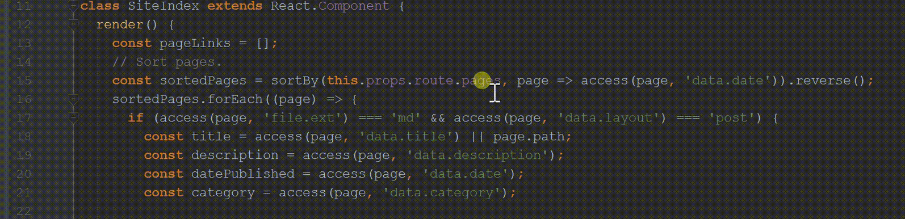
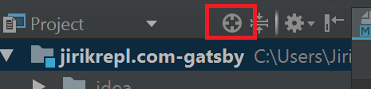
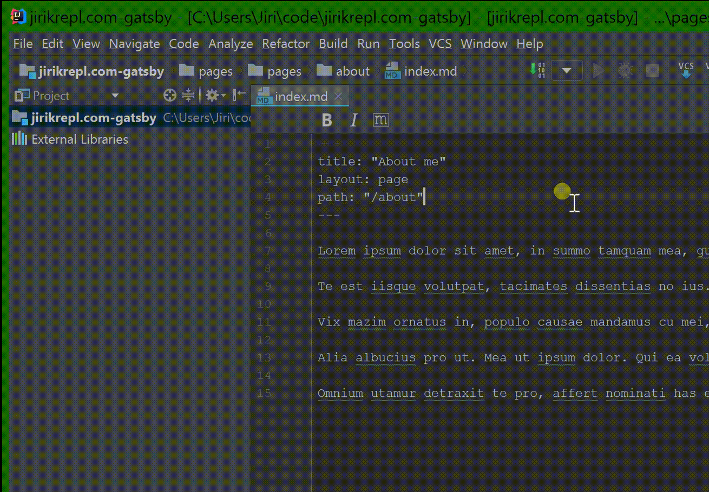

# Smart text selection
Too understand how it works, look at this gif...
  

<kbd>Ctrl</kbd> + W ... to extend selection

<kbd>Ctrl</kbd> + Shift + W ... to shrink selection

More in [documentation](https://www.jetbrains.com/help/idea/selecting-text-in-the-editor.html#d393106e155).

# Scroll to source with shortcut

Idea has nice feature when you can jump from the opened file to project tree (on this file).

You can achieve this when clicking on this icon:

But as always it is better to do in with a keyboard shortcut. To do it, make sure you have cursor in opened file (here `index.md`), then press:

<kbd>Ctrl</kbd> + <kbd>Shift</kbd> + 1, then <kbd>1</kbd>

 
 
# Open/focus project panel
Open/focus project panel with keyboard shortcut:

<kbd>Ctrl</kbd> + <kbd>1</kbd>
 
 